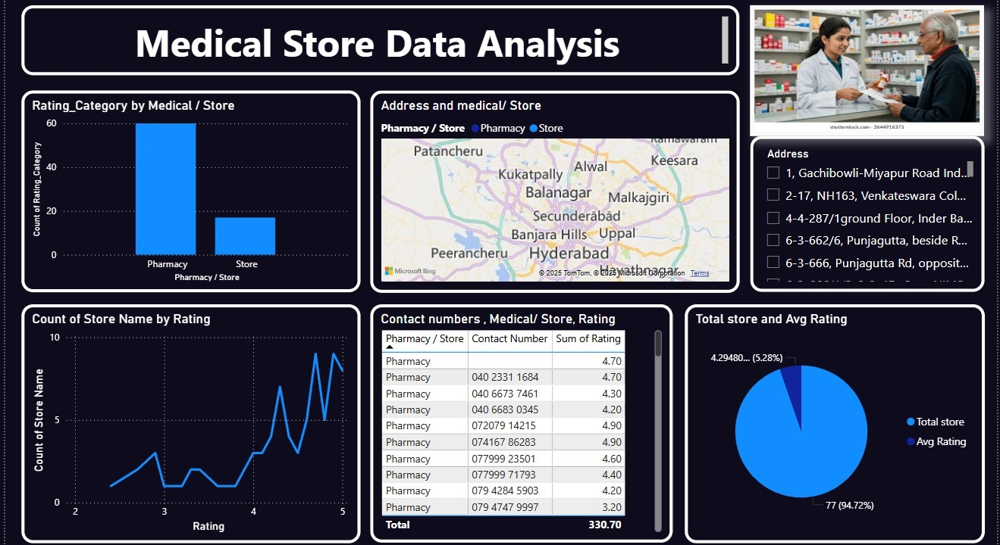

📊 **Medical Store Insights: Location & Rating Analysis**

📌 **Project Overview**
This project showcases how powerful insights can be extracted from a minimal dataset containing just three key fields: `Name`, `Location`, and `Rating`. The core focus is on performing location-based performance analysis and comparing ratings using straightforward yet highly effective analytical techniques.

This project is an excellent resource for:
- Demonstrating fundamental data analysis concepts.
- Practicing dashboard storytelling.
- Developing analytical thinking, especially for beginners and those building their data analytics portfolio.

📁 **Dataset Description**
The dataset comprises records representing various entities (e.g., medical stores, businesses, services), each associated with its geographic location and customer rating.

🔹 **Columns Included**
- **Name**: The name of the entity/business.
- **Location**: The area or city where the entity is situated.
- **Rating**: The customer rating score (typically on a 1–5 scale).

🔹 **Dataset Characteristics**
- **Lightweight**: Easy to manage and understand.
- **Versatile**: Suitable for aggregation and comparative analysis.
- **Privacy-Conscious**: Contains no personally identifiable or sensitive data.

🎯 **Key Objectives**
- Analyze and visualize average ratings by location.
- Identify top-performing and bottom-performing entities based on ratings.
- Compare performance metrics across different geographical locations.
- Illustrate the value of data analytics even with limited data points.

📈 **Analysis Performed**
- Calculation of location-wise average ratings.
- Ranking of entities based on their customer ratings.
- Analysis of rating distribution across various locations.
- Identification of high-performing and low-performing locations to pinpoint areas for improvement or success.

🛠 **Tools & Technologies**
- **Excel / SQL**: Utilized for initial data validation, cleaning, and aggregation.
- **Power BI**: Employed for robust data modeling and creating interactive, insightful visualizations.

📊 **Deliverables**
- A clean, well-structured dataset ready for analysis.
- An interactive Power BI dashboard highlighting key rating insights.
- Clear, visual comparisons of locations and individual entities.

✅ **Key Learnings**
- Even small datasets can yield significant and valuable insights.
- The critical importance of aggregation and comparison logic in data analysis.
- Mastering effective storytelling through simple, impactful visuals.

🚀 **Ideal Use Cases**
- A compelling portfolio project for aspiring Data Analysts.
- A practical exercise for honing skills in Excel, SQL, or Power BI.
- A clear demonstration of analytical thinking when working with minimal data.
